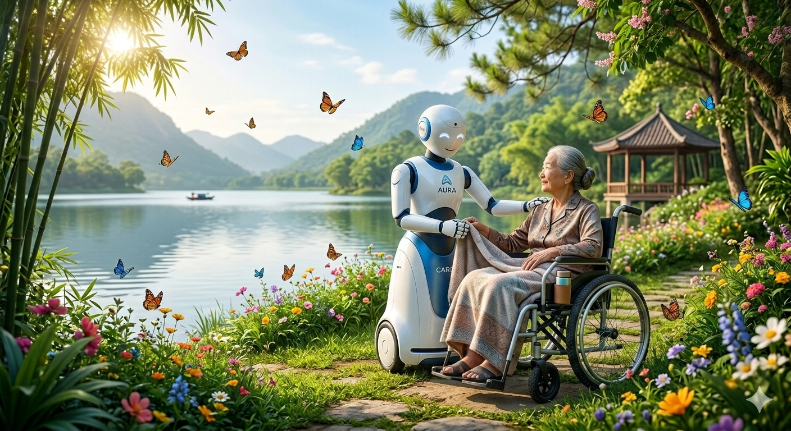

# AURA: Adaptive Universal Rehabilitation Agent
> **"Turning the silence of recovery into a symphony of hope."**

AURA is a breakthrough **Multi-Agent Robotic Ecosystem** designed to bridge the gap between physical rehabilitation and emotional restoration. It is built specifically for stroke survivors, individuals with speech/hearing impairments, and patients recovering from severe fractures.

---

## 🚀 The Vision
Rehabilitation is often lonely, painful, and frustrating. AURA transforms this journey by combining **Multi-Modal AI** with **Soft-Robotics** to create a companion that:
- **Feels** your pain through eSkin and force sensors.
- **Understands** your unspoken words through sign language and eye-tracking.
- **Inspires** your soul through personalized storytelling and haptic music.

## 🧠 System Architecture (Multi-Agent)
AURA operates on a "Sense-Think-Act" loop coordinated by a Large Language Model (LLM) Orchestrator:

1. **Perception Agent:** Uses Computer Vision (MediaPipe/ViT) for Sign Language Recognition (SLR) and Affective Computing to detect patient distress.
2. **Kinematic Agent:** Manages active balancing and zero-gravity support using Series Elastic Actuators (SEA) to prevent falls.
3. **Storyteller Agent:** Generates immersive AR/VR environments and narrations to boost dopamine and neuroplasticity.
4. **Haptic Agent:** Converts audio into tactile vibrations, allowing the deaf to "feel" the rhythm of their walking pace.
5. **IoT Orchestrator:** Acts as a Smart Home Hub, allowing patients to control their environment via gaze or gestures.

## 🛠 Technical Stack
- **AI/ML:** GPT-4o/Llama-3 (Orchestration), NVIDIA Jetson Orin (Edge Processing).
- **Control:** ROS 2 (Robot Operating System), Impedance Control, Reinforcement Learning for gait prediction.
- **Hardware:** Bio-inspired eSkin (Tactile sensing), Mecanum omni-directional drive, AR-HUD integration.

## 🤝 Call for "Power & Skill"
I am looking for a **Technical Co-founder** or **Lead Engineers** with the power to turn this architecture into a physical reality. This is not just a project; it is a movement to reclaim human dignity.

**Status:** Conceptual Framework & Architecture defined. Seeking collaborators for Prototype V1.

---
*If you are the one who can build the bridge between code and touch, let’s talk.*
